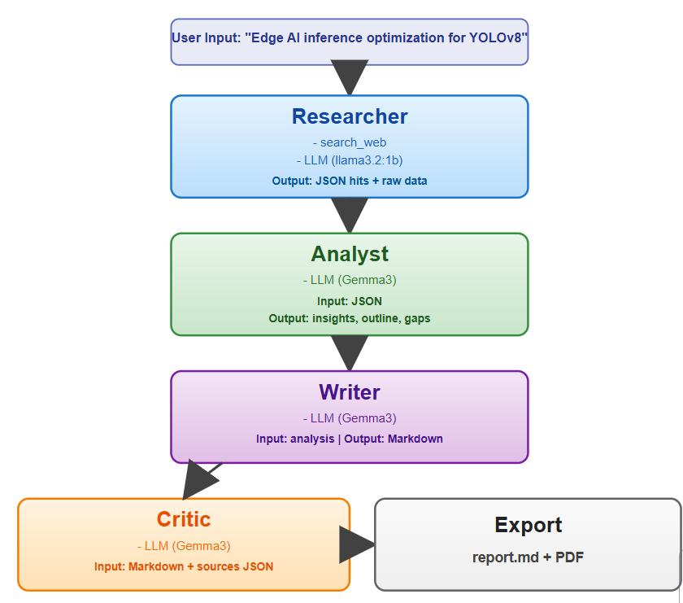
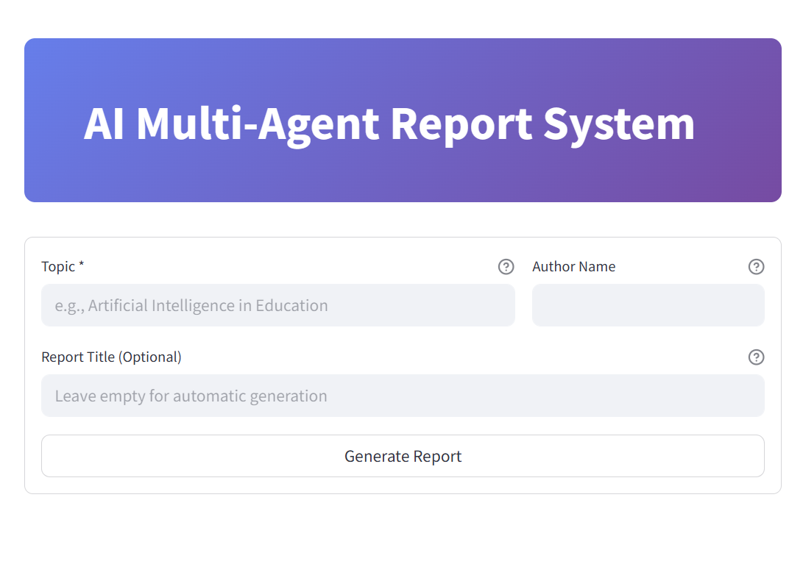

# AI Multi-Agent Report System

A modular system for generating high-quality reports using multiple AI agents.  
Each agent handles a specific stage of the workflow: research, analysis, writing, and review.  
The project includes a clean Streamlit interface and supports both English and Arabic content.

## Features

- Automated web research  
- Intelligent data analysis  
- Structured report generation  
- Report quality review and scoring  
- Streamlit user interface  
- Saves results in Markdown, HTML, and PDF  
- Fully local using Ollama models

## Running the System

1- pip install -r requirements.txt
2- ollama pull llama3.2:1b   
3- ollama pull gemma3:latest
4- streamlit run app.py
5- Then open: http://localhost:8501

### Workflow Overview

1. Researcher → Collects information
2. Analyst    → Processes and interprets data
3. Writer     → Produces the structured report
4. Critic     → Reviews clarity, accuracy, and scoring
5. Output     → Saves as Markdown, HTML, PDF

## Streamlit 

